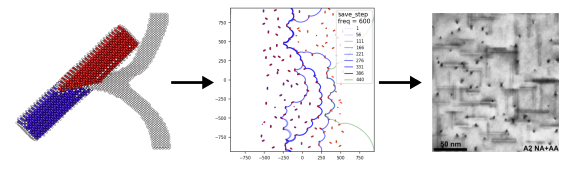
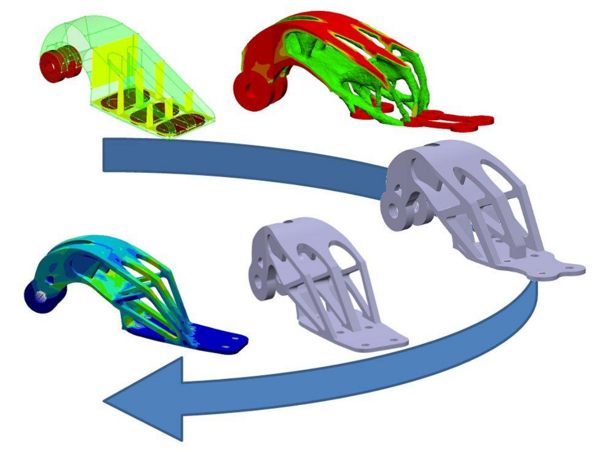
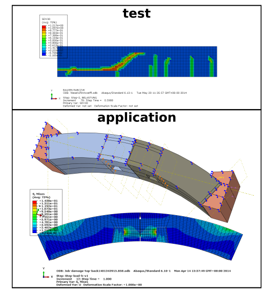

## Multiscale Mechanics for Alloys
Alloys are one of the key materials in engineering. For structural applications, we often require the material to be sufficient strong and ductile. Other requirements should be taken into account for real engineering scenarios, e.g. fatigue, corrosion resistance, high temperature properties and etc.

In my PhD research, I investigated the precipitation strengthening mechanisms in Al-6xxx alloys thoroughly. The outcome of my research is a validated rigorous model that we can rely on, when desgining new precipitate-strengthened materials. 

Some highlights of my research:
+ _a complete multiscale approach_ --- from DFT (atomistic structure database), to Molecular Simulations (Neural Network Potential), to Discrete Dislocation Dynamics (Mesoscale Simulations)
+ _atomistic accurate Mesoscale Simulations_ via incorporating the key atomistic mechanisms and features in Discrete Dislocation Dynamics
+ _use state-of-art Neural Network Potential_ in the strengthening problem
+ _strength prediction model_, useful for finding an optimal material microstructure

<h4> <a href="phd" target="blank">more details about my PhD</a></h4>

<!-- Precipitation strengthening is one of the key strengthening mechanisms in many alloy systems, e.g. aluminium alloys, magnesium alloys, nickel-based superalloy, and etc. These alloys undergo a special heat treatment to form a second phase (precipitate) in the matrix system. The  -->

## Topology Optimization

Designing mechanical components or systems often requires large amount of experiences and try-outs. Engineers usually decompose the problem into sub-parts and tackle each of them using existing assets or their creativity. _Topology Optimization_ offers the possibility to let the computer (algorithm) find the best design under certain requirements (constraints). Like the typical mathematical optimization problem, we need to define an appropriate cost function, which is our target to minimize, and specify necessary constraints. In addition, the system needs to satisfy the fundamental physical laws, such as a mechanical equilibrium, if you encounter a static problem.

Usually, the following issues need to be resolved:
1. proper definition of cost function and constraints, accounting for both solvability and underlying requirements
2. solve with physical constraints (often PDE/ODE type)
3. avoid possible optimization issues, such as checkerboard pattern, mesh dependence, or local minimal etc.

<i>application of topology optimizatin (source Altair)</i>

<h4> <a href="master" target="blank">check out phase-field approach and implementation</a></h4>

## Damage Simulation in Civil Engineering

In my undergraduate study, I was involved in simulations for Civil Engineering problems. The typical structure in Civil Engineering is reinforced concrete structures. Understanding the damage and fracture behavior of this type of structure is then decisive for real applications. In my bachelor thesis, I used the UEL and UMAT developed by Prof. Rabczuk (a collaborator of my supervisor) to perform Abaqus simulations both on RC beams and tunnel lining segments.

<!-- <h4> <a href="bachelor" target="blank">Damage model</a></h4> -->
