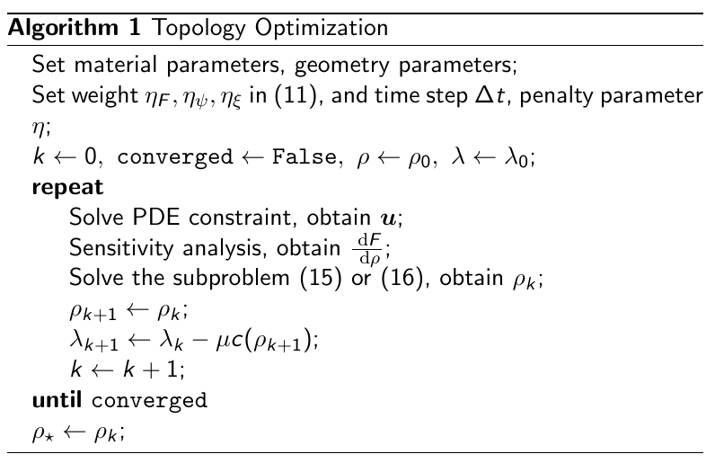
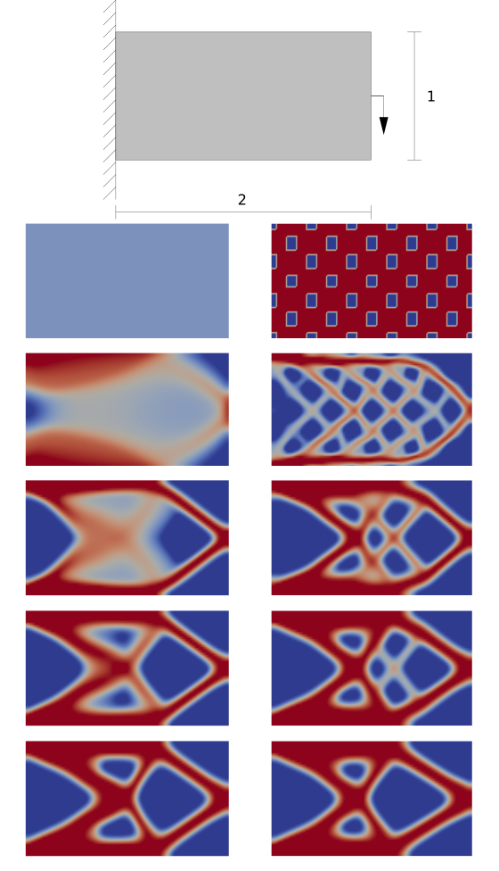
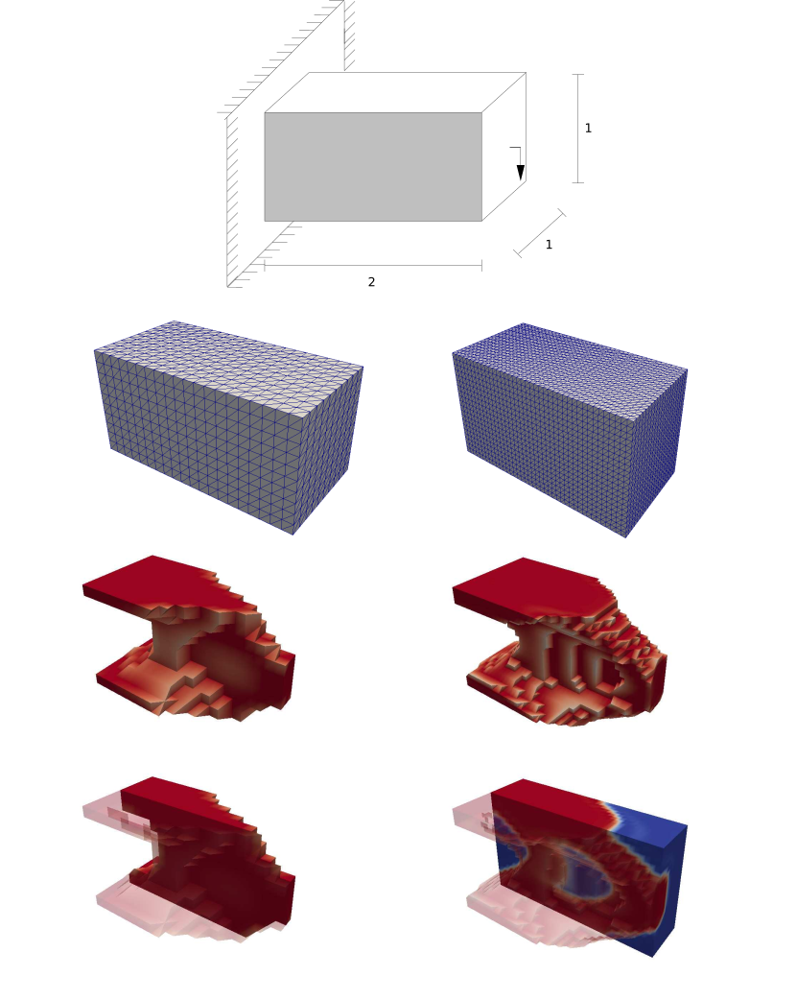
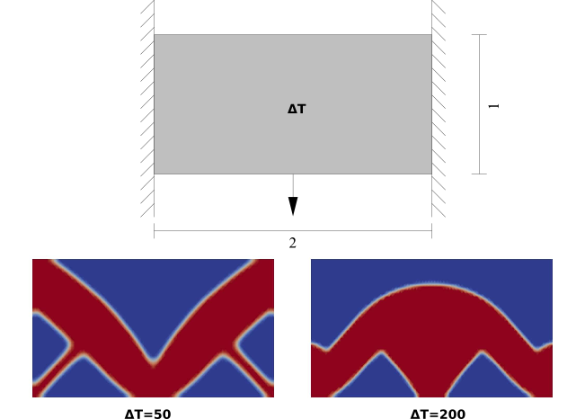

## Phase field approaches in Topology Optimization

In a Topology Optimization problem, we often have a design variable  \rho  in [-1, 1], representing how much material do we place at each point. A formal presentation of the problem is as follows


  \begin{array}{rl}
  \min\limits_{\rho} & F = F(\textbf{u}, \rho) \\
  \text{subject to} & G(\textbf{u}, \rho) = 0, \text{ (PDE constraint)} \\
  & c_{\text{vol}}(\rho) = \int_{D}^{} \rho(\textbf{x}) \: \text{d}V - V_{0} \le 0 \\
  & -1 \le \rho \le 1
  \end{array}


Alternatively, we can create an evolution equation for  \rho , such that the evolution process is equivalent with the above optimization process. In phase-field modeling, we have an evolution equation (either Allen-Cahn or Cahn-Hilliard type), and the goal is to minimize free energy. To solve the current Topology Optimization with phase-field modeling strategy, we adjust the free energy by adding the cost function. The volume constraint is accounted via a penalty term inspired by the augmented Lagrangian. So the equivalent evolution equation can be written as


\boxed{
	\def\arraystretch{2.}
	\begin{array}{rl}
	\text{solve} & \dot{\rho} = \eta_{\xi} \Delta \rho - f_{\text{src}} \\
	\text{with} & f_{\text{src}} = \dfrac{\partial}{\partial \rho} \left( \eta_{\psi} \psi + \eta_{F}F - \lambda c_{\text{vol}} + \frac{\mu}{2} c_{\text{vol}}^{2}  \right) \\
	& \lvert \rho \rvert \le 1
	\end{array}
}


Here, the math seems a little bit overwhelming, but the evolution equation is simply a diffusion-reaction equation (also an Allen-Cahn equation). The source term is composed of the double-well function  \psi  (commonly used in phase-field), the cost function, and the penalty of volume contraint. The coefficients  \eta_{\xi}, \eta_{\psi}, \eta_{F}  are adjustable variables that control the driving force of each piece of the evolution equation.

Now we only miss the PDE constraint. This is accomplished by a sensitivity analysis (adjoint problem). The derivation of ajoint problem is skipped here. A good reference is [dofin-adjoint documentation](http://www.dolfin-adjoint.org/en/latest/documentation/maths/2-problem.html).

### algorithm

The full solving algorithm is presented as follows.

<!--  -->

This algorithm is implemented in an open-source code [FEniCS](https://fenicsproject.org/). 

### simulation examples

The first working example is a standard one, namely optimization the compliance of a cantilever beam. Various tests are carried out for this simple case to validate the algorithm and clarify the coefficient parameters.

<!-- 
Some caption text
 -->

The solution in 3D is also possible. Finer mesh ends with geometry with more details.

We can also solve a therm-mechanical problem presented below. We observe a significant geometry change due to the increase of temperature change. In other words, if the structure expansion is magnified, we need a thicker lower strut to maintain the stiffness. This result is consistent with the result in literature.

<h4> <a href="master_thesis_2016.pdf" target="blank">You can check out my master thesis for further interest.</a></h4>
