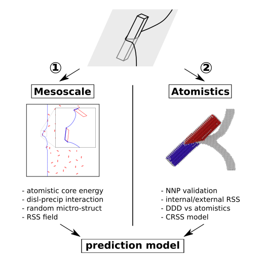
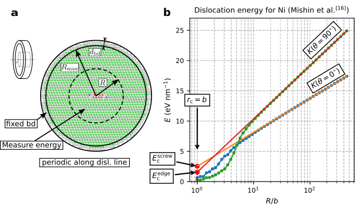
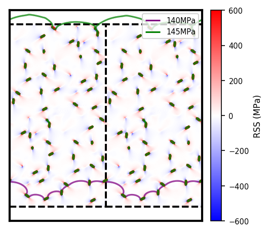
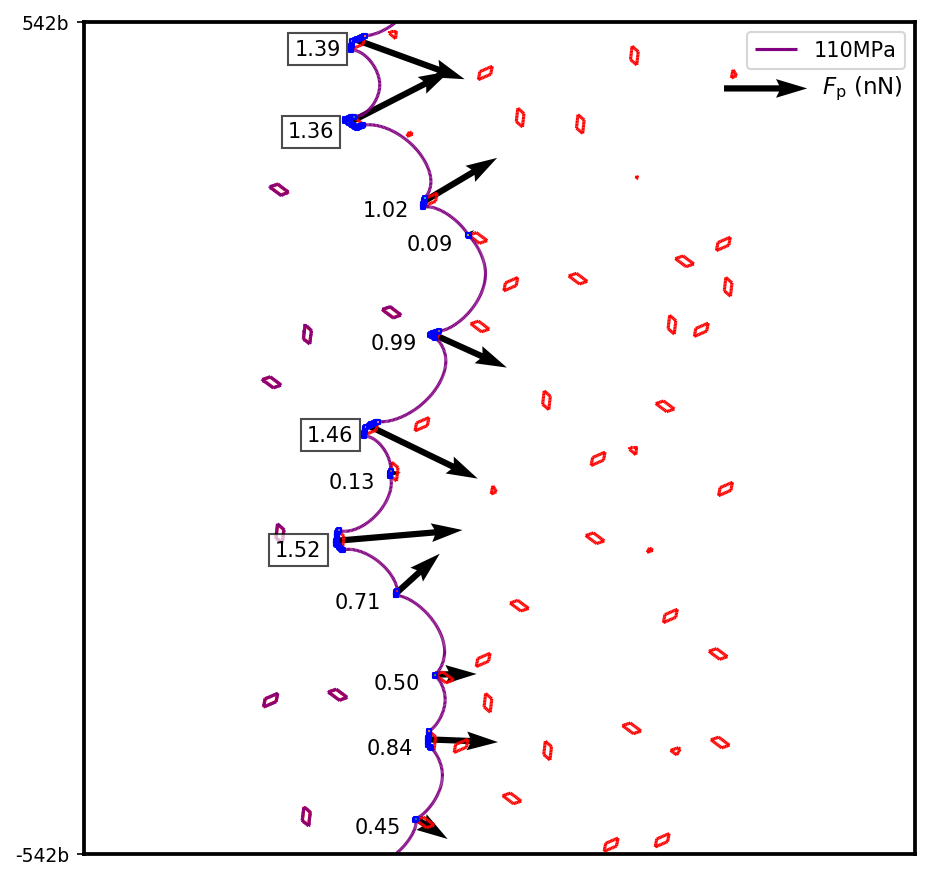
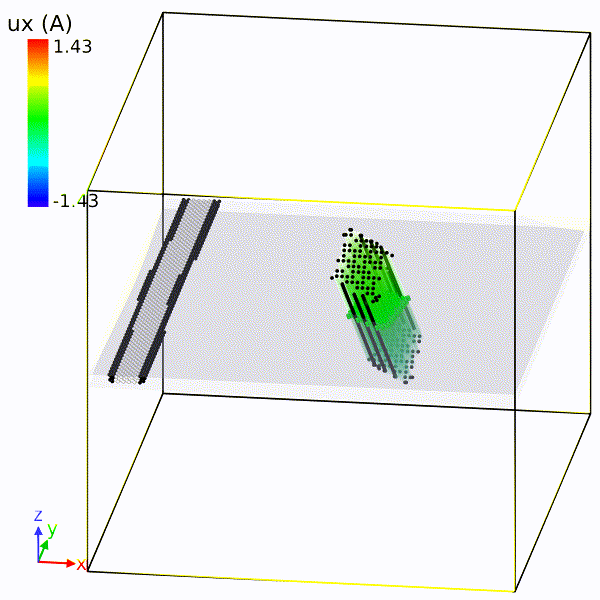

## Precipitation Strengthening in Al-Mg-Si alloys

The key to the precipitation strengthening is dislocation-precipitate interaction mechanism, i.e. how precipitates serve as obstacle to impede the movement of dislocation. The entire roadmap of my PhD research is sketched in the following figure.

<i>roadmap of my PhD research</i>

### dislocation core energy
One of the critical quantities in mesoscale simulation is dislocation core energy, which influences the strength of dislocation when bumping into an obstacle. For that, I used a flat cyclinder model to obtain the dislocation core energy for various character angles.

<i>characterization of dislocation core energy</i>

Then I implemented this atomistic information in a widely used Discrete Dislocation Dynamics code (ParaDiS). I found out that the atomistic-informed DDD simulations can match atomistic result for various cases.

<!-- Fig: one row of DD vs atom -->

Have a look at this paper, if you want more details.
<h4> <a href="https://iopscience.iop.org/article/10.1088/1361-651X/ab5489/meta?casa_token=XsmQ0VqqNgIAAAAA:Kq32XHO-8xelDhuju42r03dV9cZkL3EKhHdHHPcE_AB6veUKZ7VzAw5oHqNYeCwGMe32RU1OWjQ">Y. Hu et al. 2020 MSMSE</a></h4>

### mesoscale study
The incorporation of atomistic core energy makes me ready to invistigate more complex dislocation-precipitate interaction. First, I carried out an extensive mesoscale study, since it is more efficient than atomistic simulations, and the behavior of dislocation is more tractable. The focus of study is peak-aged Al-Mg-Si alloys, indicating that the looping mechanism (Orowan) and shearing mechanism give the same Critical Resolved Shear Stress (CRSS), which is the textbook knowledge. So I would like to see if the simulation with Orowan mechanism can predict the yield strength of the material.

For this purpose, I implemented Orown mechanism in Discrete Dislocation Dynamics, generated representative pseudo-random alloy microstructures and calculated the misfit stress in the microstructure. Extensive DDD simulations were performed for different glide planes of experimentally realistic microstructures. Important factors like precipitate volume fraction, matrix misfit stress, cross section area, system size, microstructures, and dislocation core energies were studied carefully and thouroughly.

<i>screw dislocation moving through precipitates</i>

<!-- TODO: this findings seem to be very technical and detail
The important findings are:
1. vol frac, more on L
2. RSS marginal, edge/screw difference small, averaged out, contrary to BKS
3. role of core energy -->

However, even with the core energy at finite temperature, we had an overestimate of material yield strength. Then I began to think about the cause of overestimate. A detailed force analysis on individual precipitates implied that multiple precipitates were supposed to be sheared before looped. And a simple shear calculation provides a better agreement with the realistic yield strength.

<i>the boxed forces are larger than the resisting shearing force</i>

Have a look at this paper, if you want more details.
<h4> <a href="https://www.sciencedirect.com/science/article/pii/S002250962100065X?via%3Dihub">Y. Hu and W. A. Curtin. 2021 JMPS</a></h4>

### atomistic study
After the careful mesoscale study, I hoped to find out what really happens at atomistic scale. Does the precipitate really get sheared? The state-of-art  Neural Network Potential gave us the answer. After careful and heavy validation of the potential, we were convinced that the NNP is ready to use for  solving realistic mechanics problem. Systematic dislocation-precipitate interaction simulations were carried out. They showed that dislocation can either shear or loop the precipitate, depending on precipitate orientation and precipitate internal misfit stress. The comparision between atomistic and DDD for the same geometry laid the basis for model development. 

<!-- The potential was carefully trained on a curated database by my colleagues. Since all the important DFT atomistic configurations (with force and energy) were contained in the database, it could probably capture the hidden behaviors for a realistic problem. Then I carefully validated the NNP with a bunch of calculations, including dislocation core energy calculation, and some more advanced comparisons with continuum calculation, like misfit stress calculation. It turned out that the NNP has the capacity for solving a wide range of mechanical problems, in particular, the dislocation-precipitate interactions. -->

<i>edge dislocation interacting with px/py/pz oriented precipitates</i>

### prediction model
Combining the knowledge obtained from mesoscale and atomistic study, we came up with a strategy for CRSS calculation. For looping mechanism, CRSS is calculated by the efficient atomistic-accurate DDD simulation, while for shearing mechanism, we have a validated prediction model. The lesser of two is the controlling mechanism. The prediction involves material properties (from ab-initio calculations) as well as geometry quantities, which can be optimized so that a maximal CRSS is attained.

For a realistic material, one needs to take into account many other factors, like the random arrangement of precipitate in a real system. I did a careful DDD study to demonstrate that a random factor can characterize this effect. A simplified prediction procedure is presented in the following figure.

<i>simplified yield stress prediction procedure</i>

If you have further interest, you can check out [my thesis](https://infoscience.epfl.ch/record/290650?ln=en).